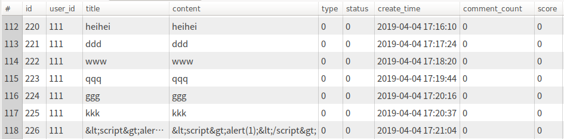

#牛客项目学习

@(学习笔记)

**牛客社区项目**是我在百度网盘白嫖的视频教程,这边写的是学习项目的笔记.仅供自己学习使用,侵权即删!
 

-------------------

[TOC]

## 第一章节: 初识Spring Boot,开发社区首页

> 使用Spring Initializr创建项目,并实现首页帖子分页显示功能.

### 数据访问层 
``` sql
'CREATE TABLE `discuss_post` (
  `id` int(11) NOT NULL AUTO_INCREMENT,
  `user_id` varchar(45) DEFAULT NULL,
  `title` varchar(100) DEFAULT NULL,
  `content` text,
  `type` int(11) DEFAULT NULL COMMENT ''0-普通; 1-置顶;'',
  `status` int(11) DEFAULT NULL COMMENT ''0-正常; 1-精华; 2-拉黑;'',
  `create_time` timestamp NULL DEFAULT NULL,
  `comment_count` int(11) DEFAULT NULL,
  `score` double DEFAULT NULL,
  PRIMARY KEY (`id`),
  KEY `index_user_id` (`user_id`)
) ENGINE=InnoDB AUTO_INCREMENT=283 DEFAULT CHARSET=utf8'
```


####每个字段代表的意思
`id` : 自增长主键
  `user_id` : 发帖子的人
  `title` : 帖子标题
  `content` : 帖子内容
  `type` : 帖子类型 ,  0-普通; 1-置顶;
  `status` : 帖子状态 , 正常; 1-精华; 2-拉黑;
  `create_time` 帖子创建时间
  `comment_count` 评论数量
  `score` 帖子分数(帖子排名使用)


####帖子实体类
```java
public class DiscussPost {

    private int id;
    private int userId;
    private String title;
    private String content;
    private int type;
    private int status;
    private Date createTime;
    private int commentCount;
    private double score;

    public int getId() {
        return id;
    }

    public void setId(int id) {
        this.id = id;
    }

    public int getUserId() {
        return userId;
    }

    public void setUserId(int userId) {
        this.userId = userId;
    }

    public String getTitle() {
        return title;
    }

    public void setTitle(String title) {
        this.title = title;
    }

    public String getContent() {
        return content;
    }

    public void setContent(String content) {
        this.content = content;
    }

    public int getType() {
        return type;
    }

    public void setType(int type) {
        this.type = type;
    }

    public int getStatus() {
        return status;
    }

    public void setStatus(int status) {
        this.status = status;
    }

    public Date getCreateTime() {
        return createTime;
    }

    public void setCreateTime(Date createTime) {
        this.createTime = createTime;
    }

    public int getCommentCount() {
        return commentCount;
    }

    public void setCommentCount(int commentCount) {
        this.commentCount = commentCount;
    }

    public double getScore() {
        return score;
    }

    public void setScore(double score) {
        this.score = score;
    }

    @Override
    public String toString() {
        return "DiscussPost{" +
                "id=" + id +
                ", userId=" + userId +
                ", title='" + title + '\'' +
                ", content='" + content + '\'' +
                ", type=" + type +
                ", status=" + status +
                ", createTime=" + createTime +
                ", commentCount=" + commentCount +
                ", score=" + score +
                '}';
    }
}
```

####mapper层 = dao层,一般为接口
> mybatis逆向工程生成的mapper层，就是dao层。对数据库进行数据持久化操作，其中的方法语句是直接针对数据库操作的
```java
/**
 @Mapper注解的作用(属于Mybatis的注解)
 1.把mapper这个DAO交給Spring管理
 2.不用再写mapper映射文件
 3.MapStruct可以帮助我们自动根据一个添加@Mapper注解的接口生成一个实现类
 */

@Mapper
public interface DiscussPostMapper {
    /**
     * 获取帖子,按页获取,
     * @param userId 用户的id
     * @param offset 每一页的起始行的行号
     * @param limit 每一页最多显示几个数据
     * @return
     */
    List<DiscussPost> selectDiscussPosts(int userId, int offset, int limit);

    /**
     * 查询帖子的行数
     * @Param注解用于给参数取别名,有的参数比较长,可以用@Param取一个别名
     * 如果sql中要动态用到这个参数,比如 <if> ,并且 <if> 条件判断只用到这一个参数,则必须加别名.
     * 但是上面一个函数用三个参数,那就可以不用取别名了.
     * @param userId
     * @return
     */
    int selectDiscussPostRows(@Param("userId") int userId);

    int insertDiscussPost(DiscussPost discussPost);

    DiscussPost selectDiscussPostById(int id);

    int updateCommentCount(int id, int commentCount);

}
```

####帖子sql配置文件,文件路径在 /resources/mapper下
```xml
<?xml version="1.0" encoding="UTF-8" ?>
<!DOCTYPE mapper
        PUBLIC "-//mybatis.org//DTD Mapper 3.0//EN"
        "http://mybatis.org/dtd/mybatis-3-mapper.dtd">
<!--  namespace绑定接口后，可以不用写接口实现类，Mybatis会通过该绑定自动帮你找到对应要执行的SQL语句 -->
<mapper namespace="com.nowcoder.community.dao.DiscussPostMapper">

    <!--  将公用字段取出,便于使用
        -->
    <sql id="selectFields">
        id, user_id, title, content, type, status, create_time, comment_count, score
    </sql>

    <sql id="insertFields">
        user_id, title, content, type, status, create_time, comment_count, score
    </sql>

    <!--  resultType为返回类型
          对于resultType字段,由于在 application.properties文件中配置了以下这段话
          mybatis.type-aliases-package=com.nowcoder.community.entity
          已经告诉它适配类在哪个包下,所以不用打出全限类名

           一个标签对应一个DiscussPostMapper中的一个方法,
           养成习惯,尽量不要写select *

     -->
    <select id="selectDiscussPosts" resultType="DiscussPost">
        <!--  <include>可以直接取用前面的公用字段
            符号 # 可以引用方法的参数,并嵌入sql语句
            如#{offset}, #{limit}
            代表引用
            List<DiscussPost> selectDiscussPosts(int userId, int offset, int limit);
            函数中的offset参数和limit参数
            -->
        select <include refid="selectFields"></include>
        from discuss_post
        where status != 2
        <if test="userId!=0">
            and user_id = #{userId}
        </if>
        order by type desc, create_time desc
        limit #{offset}, #{limit}
    </select>

    <select id="selectDiscussPostRows" resultType="int">
        select count(id)
        from discuss_post
        where status != 2
        <if test="userId!=0">
            and user_id = #{userId}
        </if>
    </select>

    <insert id="insertDiscussPost" parameterType="DiscussPost">
        insert into discuss_post(<include refid="insertFields"></include>)
        values(#{userId},#{title},#{content},#{type},#{status},#{createTime},#{commentCount},#{score})
    </insert>

    <select id="selectDiscussPostById" resultType="DiscussPost">
        select <include refid="selectFields"></include>
        from discuss_post

        where id = #{id}
    </select>

    <update id="updateCommentCount">
        update discuss_post set comment_count = #{commentCount} where id = #{id}
    </update>

</mapper>
```
###业务层
```java
/**
 * 加@Service注解能够被容器扫描到
 */
@Service
public class DiscussPostService {

    //注入discussPostMapper
    @Autowired
    private DiscussPostMapper discussPostMapper;

    @Autowired
    private SensitiveFilter sensitiveFilter;

    public List<DiscussPost> findDiscussPosts(int userId, int offset, int limit) {
        return discussPostMapper.selectDiscussPosts(userId, offset, limit);
    }

    public int findDiscussPostRows(int userId) {
        return discussPostMapper.selectDiscussPostRows(userId);
    }

    public int addDiscussPost(DiscussPost post) {
        if (post == null) {
            throw new IllegalArgumentException("参数不能为空!");
        }

        // 转义HTML标记
        post.setTitle(HtmlUtils.htmlEscape(post.getTitle()));
        post.setContent(HtmlUtils.htmlEscape(post.getContent()));
        // 过滤敏感词
        post.setTitle(sensitiveFilter.filter(post.getTitle()));
        post.setContent(sensitiveFilter.filter(post.getContent()));

        return discussPostMapper.insertDiscussPost(post);
    }

    public DiscussPost findDiscussPostById(int id) {
        return discussPostMapper.selectDiscussPostById(id);
    }

    public int updateCommentCount(int id, int commentCount) {
        return discussPostMapper.updateCommentCount(id, commentCount);
    }

}

```
###视图层
```java
package com.nowcoder.community.controller;

import com.nowcoder.community.entity.DiscussPost;
import com.nowcoder.community.entity.Page;
import com.nowcoder.community.entity.User;
import com.nowcoder.community.service.DiscussPostService;
import com.nowcoder.community.service.LikeService;
import com.nowcoder.community.service.UserService;
import com.nowcoder.community.util.CommunityConstant;
import org.springframework.beans.factory.annotation.Autowired;
import org.springframework.stereotype.Controller;
import org.springframework.ui.Model;
import org.springframework.web.bind.annotation.RequestMapping;
import org.springframework.web.bind.annotation.RequestMethod;

import java.util.ArrayList;
import java.util.HashMap;
import java.util.List;
import java.util.Map;

@Controller
public class HomeController implements CommunityConstant {

    @Autowired
    private DiscussPostService discussPostService;

    @Autowired
    private UserService userService;

    @Autowired
    private LikeService likeService;

    @RequestMapping(path = "/index", method = RequestMethod.GET)
    public String getIndexPage(Model model, Page page) {
        // 方法调用钱,SpringMVC会自动实例化Model和Page,并将Page注入Model.
        // 所以,在thymeleaf中可以直接访问Page对象中的数据.
        page.setRows(discussPostService.findDiscussPostRows(0));
        page.setPath("/index");

        List<DiscussPost> list = discussPostService.findDiscussPosts(0, page.getOffset(), page.getLimit());
        List<Map<String, Object>> discussPosts = new ArrayList<>();
        if (list != null) {
            for (DiscussPost post : list) {
                Map<String, Object> map = new HashMap<>();
                map.put("post", post);
                User user = userService.findUserById(post.getUserId());
                map.put("user", user);

                long likeCount = likeService.findEntityLikeCount(ENTITY_TYPE_POST, post.getId());
                map.put("likeCount", likeCount);

                discussPosts.add(map);
            }
        }
        model.addAttribute("discussPosts", discussPosts);
        return "/index";
    }

    @RequestMapping(path = "/error", method = RequestMethod.GET)
    public String getErrorPage() {
        return "/error/500";
    }

}

```
